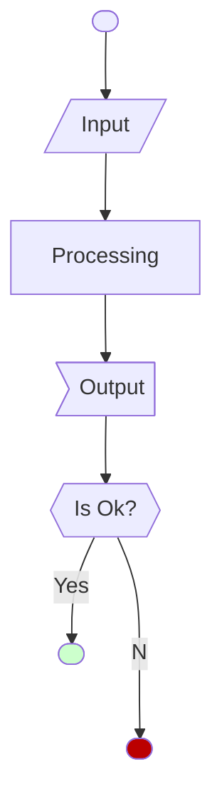

# Titolo di primo livello
## Titolo di secondo livello
### Titolo di terzo livello

Testo normale
* Primo punto
* Secondo punto

In **grassetto**, in _corsivo_, in _**grassetto e corsivo**_.

```rust
fn main() {
    let a = 4;
}
```

```c
int main() {
    float a = 4.0;
}
```


