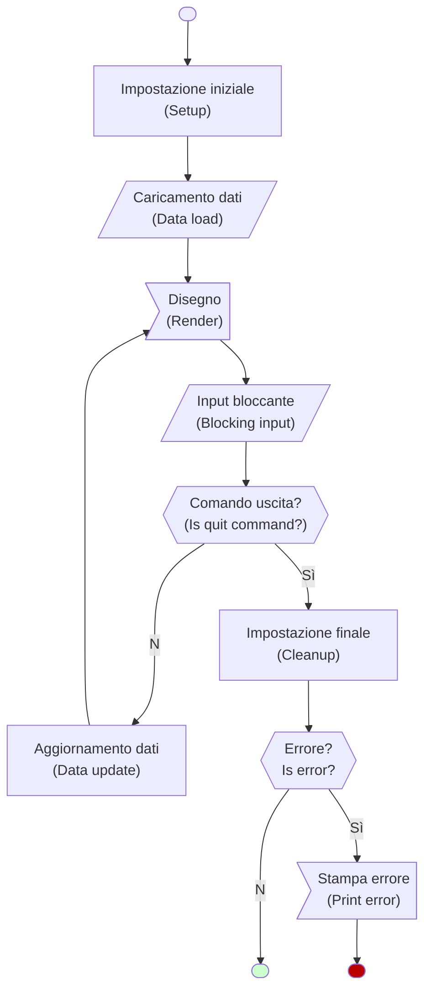

```mermaid
%% start ([ ])
%% input [/ Input /]
%% processing [ Processing ]
%% output > Output ]
%% decision {{ Is Ok? }}
%% success ([ ]); style success fill:#cfc
%% failure ([ ]); style failure fill:#b00
flowchart TD
    start([ "" ])
    setup["Impostazione iniziale\n(Setup)"]
    load[/"Caricamento dati\n(Data load)"/]
    render>"Disegno\n(Render)"]
    input[/"Input bloccante\n(Blocking input)"/]
    is_quit{{"Comando uscita?\n(Is quit command?)"}}
    update["Aggiornamento dati\n(Data update)"]
    cleanup["Impostazione finale\n(Cleanup)"]
    is_error{{Errore?\nIs error?}}
    print_error>"Stampa errore\n(Print error)"]
    success([ "" ]); style success fill:#cfc
    failure([ "" ]); style failure fill:#b00

    start-->setup
    setup-->load
    load-->render
    render-->input
    input-->is_quit
    is_quit--No-->update
    update-->render
    is_quit-- Sì -->cleanup
    cleanup-->is_error
    is_error--No-->success
    is_error--Sì-->print_error
    print_error-->failure
```
